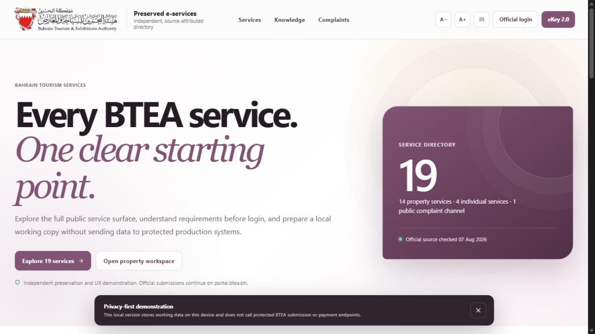
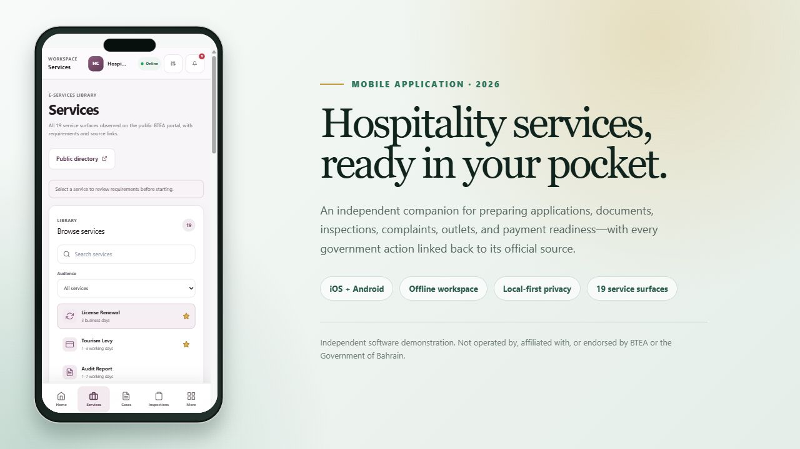

# BTEA Hospitality Hub

An independent, source-attributed preservation and UX reconstruction of the public [BTEA E-services portal](https://portal.btea.bh/). It keeps the complete observed service directory visible while adding a local workspace for preparation, tracking, and testing.

The preserved public header uses the exact BTEA wordmark published by the source portal. Its source, checksum, and permitted project scope are documented in [`BRANDING.md`](BRANDING.md). The native app icon and store identity remain original so the companion cannot be mistaken for an official government application.





This project is not an official Bahrain Tourism and Exhibitions Authority service. It does not copy private portal code, bypass authentication, submit production applications, send SMS messages, or process money.

The native iOS and Android product is deliberately named **Hospitality Services Companion** so its store identity cannot be confused with an official government app.

## Preserved public surface

- All 19 observed service entries: 14 registered-property services, 4 individual/unregistered-organization services, and the public complaint channel.
- Publicly available timing, fee, document, and workflow summaries, with an official source link on every service.
- Separate paths for eKey sign-in, eKey 2.0, inspection/classification, complaints, FAQs, regulations, circulars, accessibility, and contact information.
- Honest `Details pending` labels where the public BTEA page does not publish usable requirements.

## Improvements

- Searchable and filterable service directory before authentication.
- Persistent local applications with document metadata, readiness lists, and a five-stage timeline.
- Inspection preparation checklist and history.
- Payment-readiness ledger that never processes real money.
- Reconstructed complaint workflow with POST-based local verification. Phone numbers and codes are not placed in URLs; only the last four digits are retained by the API simulation.
- Accessible labels, skip links, keyboard focus states, text sizing, high contrast, responsive layouts, and reduced-motion support.
- A zero-dependency local API adapter with explicit `externalWrite: false` responses and browser-only fallback storage.

## Run it

Install dependencies and start both development processes:

```bash
npm install
npm run dev:api
```

In a second terminal:

```bash
npm run dev
```

Open `http://127.0.0.1:4173/` for the public directory or `http://127.0.0.1:4173/portal.html` for the workspace.

For the production-style local server:

```bash
npm run build
npm run serve
```

## Verification

```bash
npm run lint
npm run test:run
npm run build
```

The test suite covers the service count/category contract, source metadata, local application creation, complaint verification boundaries, and static-path safety.

## Native mobile apps

Capacitor 8.5 projects are checked in under `android/` and `ios/`. The native build starts in the app workspace, includes safe-area handling and a five-tab phone navigation bar, works with local saved data while offline, and uses native network status, status-bar, and haptic integrations without requesting sensitive permissions.

Prepare and synchronize the native web bundle:

```bash
npm run native:sync
```

Open the platform project on the appropriate build host:

```bash
npm run native:android
npm run native:ios
```

Android targets API 36 for the 31 August 2026 Google Play deadline. App Store uploads must be archived on macOS with Xcode 26 and the iOS 26 SDK. The repository cannot provide the release owner's Apple team, Android signing key, or verified store-account contact information.

Store metadata, privacy answers, government-information disclosures, review notes, and the release-owner checklist are in [`store/`](store/2026-COMPLIANCE.md). Run the local policy verifier after syncing:

```bash
npm run store:audit
```

## Integration boundary

`src/services/portalApi.js` only calls this repository's `/api/portal` adapter. Real identity, regulatory decisions, fees, payments, inspection results, CAPTCHA, notifications, and authoritative status must remain on the official BTEA systems until their owners provide a documented, authorized integration.

An outlet sync can be explicitly configured with `VITE_BTEA_OUTLET_SYNC_URL`; no production endpoint is contacted by default.

## Security and privacy

Use synthetic information locally. The development verification code is a visible simulation, not an SMS. Uploaded files remain on the device; only file names and sizes are tracked in working data. Report security issues privately as described in [SECURITY.md](SECURITY.md).

The mobile privacy policy is available in [`PRIVACY.md`](PRIVACY.md) and inside the app under **More > Privacy & data controls**.

## License

Released under the [MIT License](LICENSE).
